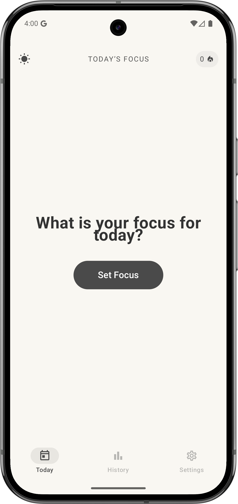
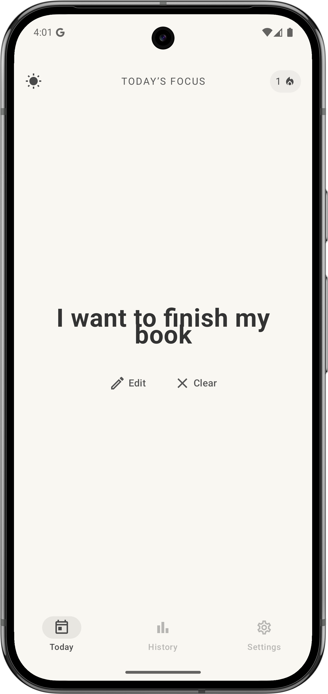
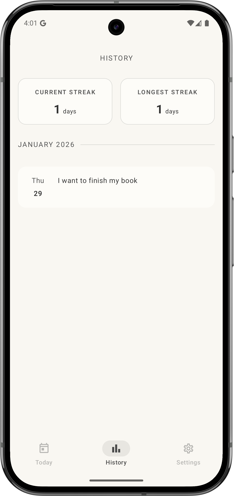
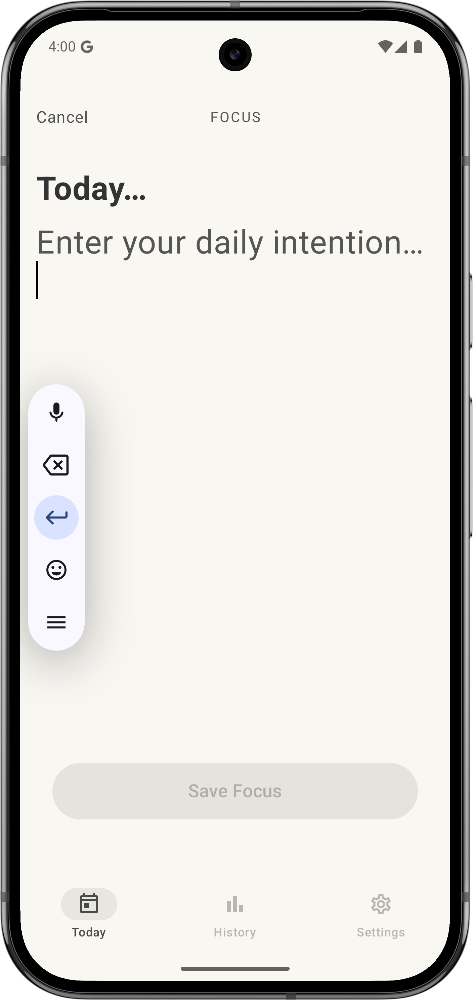
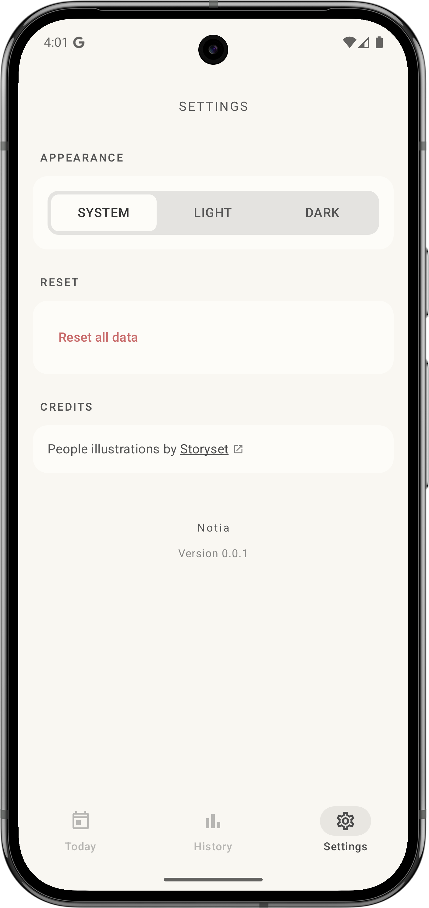

# Notia 🌿
*A calm daily focus app (Kotlin Multiplatform)*

**Notia** is a minimalist **Kotlin Multiplatform (KMP)** app designed to help users define **one meaningful focus per day** — without pressure, guilt, or productivity obsession.

The app emphasizes clarity, reflection, and continuity rather than habit enforcement or streak-chasing.  
It is built with **shared business logic** and **platform-specific UIs**, following modern KMP best practices.

---

## 📸 Screenshots

| Today (Empty) | Today (Filled) | History |
| :---: | :---: | :---: |
|  |  |  |

| Today (Edit) | Settings |
| :---: | :---: |
|  |  |

---

## ✨ Core Philosophy

- **One day, one focus**
- **A fresh start every morning**
- **No punishment for missing days**
- **Streaks are informational, not motivational**
- Calm, readable, distraction-free UI

> Notia is not about doing more.  
> It’s about knowing what matters *today*.

---

## 🌍 Kotlin Multiplatform Overview

Notia is structured as a **Kotlin Multiplatform project**, with shared domain and data logic and platform-specific presentation layers.

### Shared (KMP)
- Business rules (focus & streak logic)
- Repositories and data models
- Date handling via `kotlinx.datetime`
- Persistence abstractions

### Platform-Specific
- **Android**: Jetpack Compose + Material 3
- *(iOS-ready architecture — UI layer can be implemented with SwiftUI)*

---

## 🧱 Tech Stack

### Shared
- **Kotlin Multiplatform**
- **kotlinx.datetime**
- **Coroutines & Flow**

### Android
- **Jetpack Compose**
- **Material 3**
- **Koin** (Dependency Injection)
- **DataStore** (Persistence)
- **Compose Foundation Pager** (Onboarding)

---

## 📝 Daily Focus

- Users can set **one focus per day**
- Editing replaces the focus for that day
- Focus automatically moves to history at midnight
- Today’s focus is also visible in history

### Shared Data Model

```kotlin
data class DailyFocus(
    val date: LocalDate,
    val text: String
)
```

---

## 🔥 Streak Logic

Streaks are **informational only** and never punitive.

### Rules

* If **today has a focus**, the streak counts from today backward
* If **today is missing but yesterday exists**, the streak still counts
* If a day is skipped, the streak resets
* Longest streak is tracked independently

### Example

| Days            | Result     |
| --------------- | ---------- |
| Mon–Tue–Wed     | streak = 3 |
| Thu (missed)    | streak = 0 |
| Fri (new entry) | streak = 1 |

---

## 📜 History Screen

### Design Goals

* Calm, readable list
* Grouped by **month**
* No timeline lines
* No “missing day” placeholders
* Visual grouping via cards and surfaces

### Features

* Displays **current streak** and **longest streak**
* Includes today’s focus
* Empty state when no history exists

---

## 🎨 Theming (Android)

* Supports **System / Light / Dark**
* Theme selection via Settings
* Fully Material 3–based color usage

```kotlin
enum class ThemeMode {
    SYSTEM, LIGHT, DARK
}
```

Applied at the app root:

```kotlin
NotiaTheme(themeMode = themeMode) {
    MainScreen()
}
```

---

## ⚙️ Settings Screen

### Implemented

* Theme selection (System / Light / Dark)
* App version display
* Reset all data (focus + history)
* Credits section for third-party assets

### Planned

* Reminder notifications
* Onboarding replay
* Accessibility improvements

---

## 🚀 Onboarding

* Displayed **only once** on first launch
* Pager-based (swipeable)
* Replayable later from Settings
* Calm, story-like progression
* No fake data or forced actions

### Pages

1. **Intro** – What Notia is
2. **Fresh Start** – How focuses move into history
3. **Get Started** – Gentle invitation to begin

---

## 🧩 Common UI Components (Android)

Reusable components ensure visual and behavioral consistency:

* `NotiaTopBar`
* `NotiaPrimaryButton`
* `NotiaSecondaryButton`
* `NotiaTextButton`
* `StreakPill`
* Unified spacing and typography system

---

## 🧪 Testing

* Shared business logic tested in the **KMP shared module**
* Repository-level tests for:

    * Streak calculation
    * Missing-day behavior
    * Longest streak logic
* Fake storage and fake date providers used for deterministic tests

---

## 🌱 Design Principles

* Calm over clever
* Readability over density
* Reflection over productivity
* Consistency over customization

---

## 🔮 Roadmap

* 🔔 Daily reminders
* 🧭 Onboarding replay from Settings
* 🎨 Final color palette polish
* 🖼 App icon and branding
* 🍎 iOS UI implementation (SwiftUI)
* 🧪 Expanded shared-module tests

---

## 📄 License

Private project.

---

> **Notia is not about doing more.**
> **It’s about knowing what matters today.**
